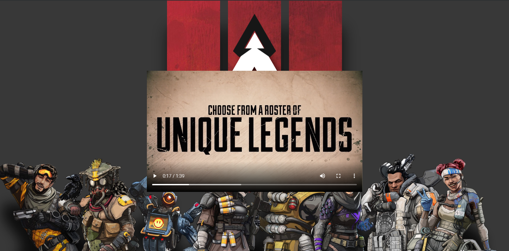

## Apex Video Streaming

[Preview](https://apex-videostream.netlify.app/)



### Key Controls

| Key |      Action      |
| :-: | :--------------: |
|  ⬆  |    Volume Up     |
|  ⬇  |   Volume Down    |
|  ➡  | Move 5s Forward  |
|  ⬅  | Move 5s Backward |

### Folder Structure

```
├── ...
├── public
│ ├── ...images
│ ├── index.html
│ └── manifest.json
├── src
│ ├── assets                        # media files related to project
│ │ ├── apex_mobile.jpg
│ │ ├── Apex.png
│ │ └── background.png
│ ├── hooks                         # custom hooks
│ │ ├── useFallBack.js              # fallback case of refresh browser
│ │ └── useKeyDown.js               # video controls from keys
│ ├── App.css                       # styles for App component
│ ├── App.js                        # Main component
│ ├── index.css
│ └── index.js
├── ...
```
